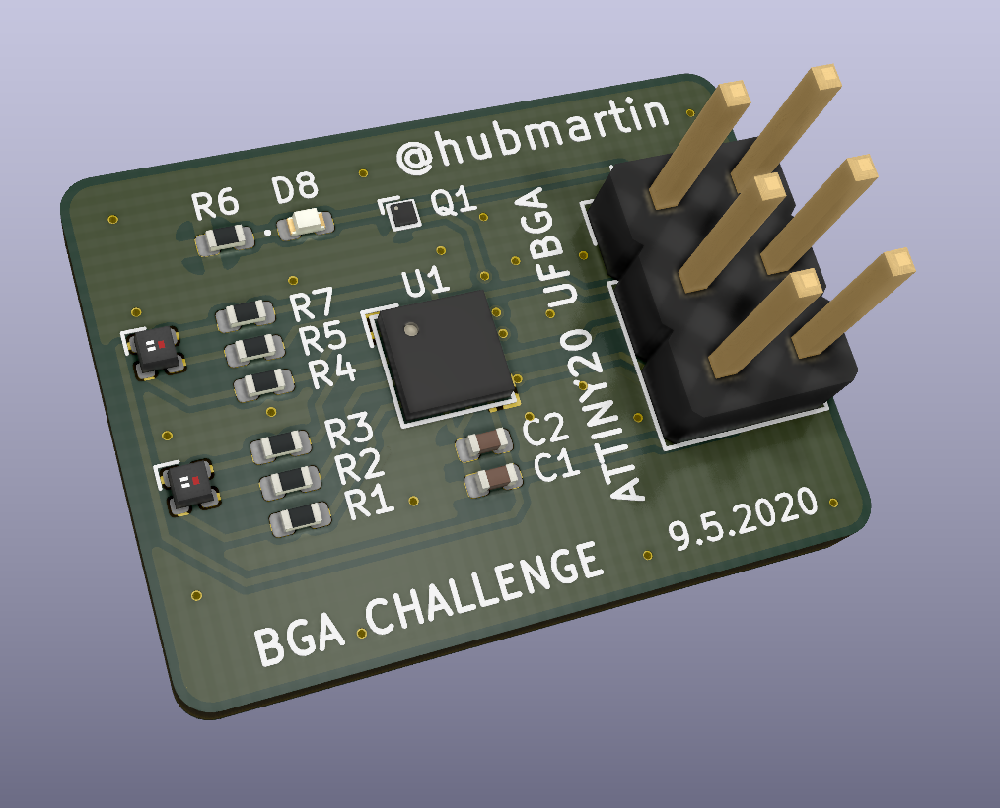
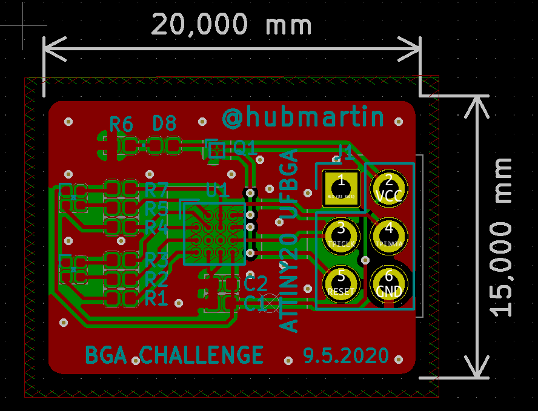
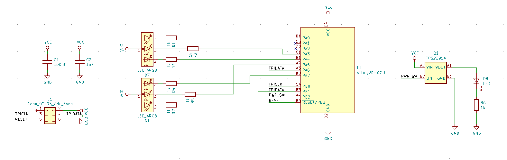

# BGA Challenge

I wanted to improve my assembly and "cutting-edge" PCB pool technical size limits so I've designed this board in KiCAD. It's just 20 x 15 mm PCB.

Board was made with Aisler. Here is the [sharing link](https://aisler.net/p/JWEQJIAC) if you would like to manufacture PCB and stencil.

More info and pictures in these tweets:
- https://twitter.com/hubmartin/status/1266421947304476685
- https://twitter.com/hubmartin/status/1251945517552144384

# ATTiny20 programming

This board is using 6 pin programmer. ATTiny20 is using TPI programming (instead of ISP) where MOSI pin is bi-directional. You can use [USBasp  programmer by Thomas Fischl](https://www.fischl.de/usbasp/), make sure you have the latest version of firmware with TPI support `usbasp.2011-05-28`. I've read that chinese clones use older firmwares (11 years).

You can also use Arduino to program chip. [Bitluni has a great video about it.](https://www.youtube.com/watch?v=AL9vK_xMt4E)

# Example code

The example code is just blinking to test that you soldered everything right. The power-switch is not controlled yet, as I did not managed to solder this 2x2 BGA correctly yet.

You compile firmware with `build.sh` and flash it with `flash.sh`. Other scripts are for ATtiny204 but that's a different project.